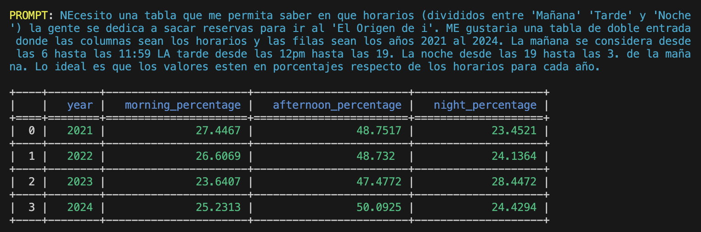

# Ask My DB

## Introduction

NO MORE SQL FOR YOU!




Welcome to **Ask My DB**, an innovative project designed to interact with a PostgreSQL database using natural language prompts. This project leverages the power of OpenAI's GPT-4 to generate SQL queries based on user input and seamlessly executes these queries on your database. The results are then formatted into a CSV file for easy consumption.

## Features

- **Natural Language Processing**: Generate SQL queries using GPT-4 based on user prompts.
- **Database Integration**: Connects to a PostgreSQL database, retrieves schema information, and executes queries.
- **CSV Export**: Converts query results into CSV files with unique timestamps to avoid overwriting.
- **Modular Design**: Clean separation of concerns with dedicated classes for database interaction, GPT query generation, and core logic handling.

## Project Structure

```plaintext
project_directory/
├── .conf/
│   └── .env.template
├── src/
│   ├── __init__.py
│   ├── gpt_asker.py
│   ├── querier_db.py
│   ├── queries_core.py
├── tests/
│   ├── __init__.py
│   ├── conftest.py
│   ├── test_gpt_asker.py
│   ├── test_querier_db.py
│   └── test_queries_core.py
├── .gitignore
├── docker-compose.yml
├── requirements.txt
├── setup.py
└── README.md
```

## Getting Started

### Prerequisites

- Python 3.8 or higher
- PostgreSQL database
- Docker (optional for running PostgreSQL locally)
- OpenAI API key

### Installation

1. **Clone the Repository**:
    ```bash
    git clone https://github.com/yourusername/ask-my-db.git
    cd ask-my-db
    ```

2. **Setup Environment**:
    ```bash
    cp .conf/.env.template .conf/.env
    ```

    Edit the `.conf/.env` file to include your database and OpenAI credentials.

3. **Install Dependencies**:
    ```bash
    pip install -r requirements.txt
    ```

4. **Run PostgreSQL**:
    You can either run PostgreSQL locally or use Docker:
    ```bash
    docker-compose up -d
    ```

### Usage

1. **Initialize the Database**:
    Ensure your database is set up and has the required tables. You can use the provided migration scripts or setup manually.

2. **Run the Application**:
    ```bash
    python src/main.py
    ```

3. **Interact with the System**:
    Enter your natural language query when prompted. The system will generate a SQL query, execute it, and save the results to a uniquely named CSV file.
    NOTE: the prompt is being harcoded in main.py you must modify it here :)

### Example

```python
from src.queries_core import QueriesCore

queries_core = QueriesCore()
prompt = "Get all users with their names and companies they work for."
result = queries_core.answer_user_prompt(prompt)
print(result)
```

## Testing

To run the tests, ensure you have \`pytest\` installed and run the following command:

```bash
pytest
```

The tests will verify the functionality of the database interactions, GPT prompt handling, and the CSV file generation.

## Contributing

We welcome contributions to enhance the functionality and features of this project. Please fork the repository, create a new branch, and submit a pull request with your changes.

## License

This project is licensed under the MIT License.

## Contact

For any inquiries or support, please reach out to [ignacio.rigoni@gmail.com](mailto:ignacio.rigoni@gmail.com).

---

Thank you for using **Ask My DB**! We hope this tool makes your database interactions more intuitive and efficient. Happy querying!

---

**Author**: Ignacio Rigoni  
**Repository**: [GitHub Repository URL](https://github.com/nachokhan/ask-my-db)
